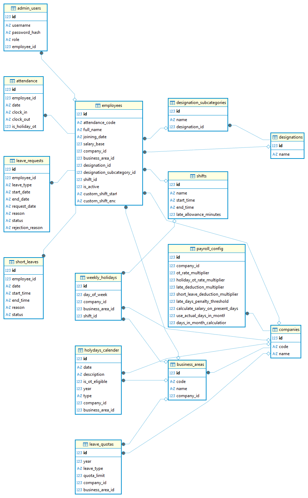

# AttenSync - HRMS & Terminal System

## Overview
AttenSync is a comprehensive desktop-based Human Resource Management System (HRMS) featuring a facial recognition attendance terminal and an administrative portal for managing employees, shifts, leave, and payroll.


## Prerequisites
- **Python**: Version 3.10 or higher is recommended.
- **pip**: Python package installer.

## Installation

### 1. Clone the Repository
Open your terminal or command prompt and clone the repository:
```bash
git clone <repository_url>
cd DeskTop_Version
```

### 2. Create a Virtual Environment (Recommended)
It is good practice to run the application in a virtual environment to manage dependencies.

**Windows:**
```bash
python -m venv venv
venv\Scripts\activate
```

**macOS/Linux:**
```bash
python3 -m venv venv
source venv/bin/activate
```

### 3. Install Dependencies
Install the required Python packages using `pip`:
```bash
pip install -r requirements.txt
```

## Running the Application

To start the application, run the `main.py` file:

```bash
python main.py
```

### First Run
- Upon the first launch, a **Setup Wizard** will appear.
- You will be asked to configure basic settings:
  - **Time Format**: 12-hour or 24-hour.
  - **Database Location**: Default is recommended.
- **Admin Account Creation**: The wizard will prompt you to create an admin account (Username/Password). 
  - *Tip: Remember these credentials as they are required to access the Admin Portal.*

## Usage

The application window is divided into two main sections:

### 1. Employee Terminal (Left Side)
- **Clock In/Out**: Employees can enter their 6-digit Attendance Code or use Facial Recognition (if configured) to mark attendance.
- **Status**: Shows current date, time, and shift status.

### 2. Admin Portal (Right Side)
- Login using the admin credentials created during setup.
- **Dashboard**: View daily attendance stats and charts.
- **Employees**: Add, edit, and manage employee profiles, assign shifts, and enroll biometrics.
- **Attendance**: View and manually correct attendance records.
- **Leaves**: Manage leave requests and quotas.
- **Payroll**: Generate monthly payroll reports.
- **Settings**: Configure company details, master data (Designations, Departments), and system backups.

## Troubleshooting
- **Database Errors**: If you encounter database issues, ensure the `data` folder exists and has write permissions.
- **Camera Issues**: Ensure your webcam is connected and allowed for the application if using facial recognition.
